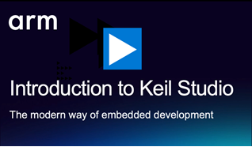

# Keil Studio - Get Started

[Keil Studio](https://mdk-packs.github.io/vscode-cmsis-solution-docs/index.html) is Arm's new IDE for embedded
development directly in Visual Studio Code and the successor to the µVision IDE.

Learn how to get started with Keil Studio:

> [!NOTE]
> This repository is deprecated and superseded by [Hello_World](https://github.com/Arm-Examples/Hello_World).
